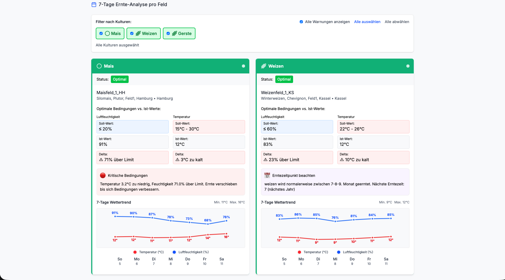
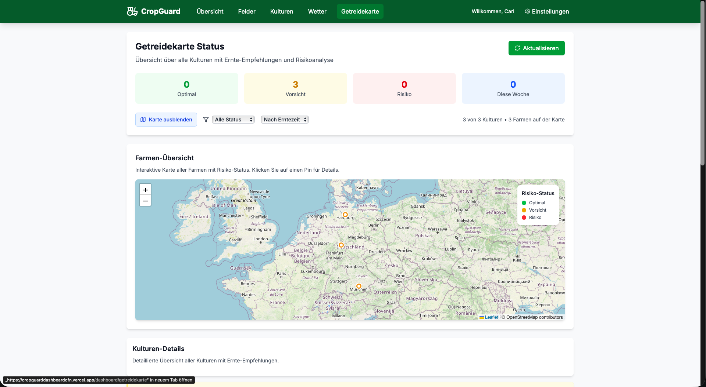
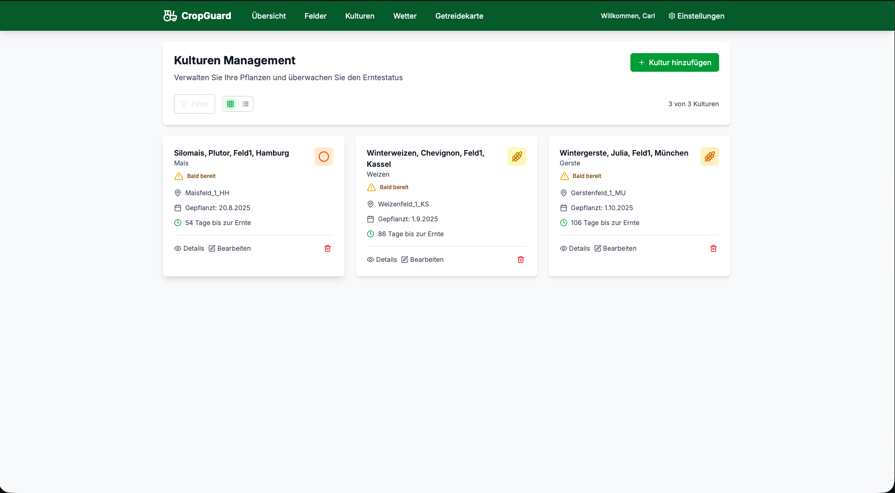
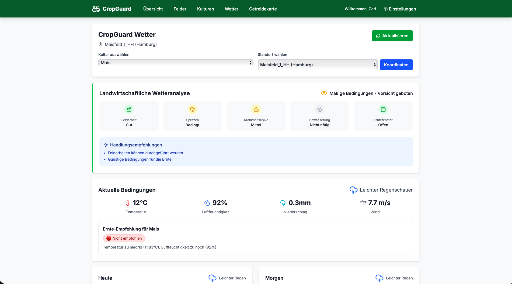

# 🌾 CropGuard - Agricultural Dashboard

> **Smart harvest management with real-time weather integration and intelligent risk analysis**

[](https://nextjs.org/)
[](https://www.typescriptlang.org/)
[](https://react.dev/)
[](https://www.prisma.io/)
[](https://opensource.org/licenses/MIT)

[**🚀 Live Demo**](https://cropguarddashboardcfn.vercel.app/dashboard) • [**Documentation**](./PRESENTATION.md) • [**Deploy Guide**](./DEPLOYMENT.md)

---

## 📖 About The Project

**CropGuard** is a modern full-stack agricultural dashboard designed to help farmers make data-driven decisions for optimal harvest timing. By combining real-time weather data with crop-specific algorithms, the platform provides intelligent risk assessments and actionable recommendations.

### 🎯 Problem Solved

- **Harvest Risk Minimization** - Weather-based decision making for optimal harvest windows
- **Crop-Specific Analysis** - Different crops have different requirements (Wheat ≠ Corn ≠ Rapeseed)
- **Centralized Management** - One dashboard for farm management, weather data, and harvest planning
- **Mobile Accessibility** - Fully responsive design for field use

---

## ✨ Key Features

### 🗺️ **Interactive Farm Mapping**
- Leaflet-powered interactive map of Germany
- Color-coded risk indicators (Green/Yellow/Red)
- Click-to-view detailed farm information
- Geographic overview of all farm locations

### 🌤️ **Real-Time Weather Integration**
- OpenWeatherMap API integration
- 7-day weather forecasts
- Agricultural-specific weather analysis
- Field work suitability indicators
- Disease risk assessment

### 📊 **Intelligent Risk Analysis**
- Crop-specific temperature and humidity requirements
- Seasonal context-aware recommendations
- Multi-factor risk scoring
- Harvest timing optimization

### 🌱 **8 Crop Types Supported**
- **Grains**: Wheat, Barley, Corn
- **Oil Seeds**: Rapeseed, Sunflowers
- **Root Vegetables**: Potatoes, Sugar Beets
- **Vegetables**: Tomatoes

### 📱 **Complete Farm Management**
- Full CRUD operations for farms and crops
- Real-time weather conditions per farm
- Harvest countdown and status tracking
- Quick stats and irrigation recommendations

### 🎨 **Modern UI/UX**
- Responsive design (mobile, tablet, desktop)
- Dark mode ready architecture
- Intuitive navigation
- German localization

---

## 🛠️ Tech Stack

### Frontend
- **Framework**: [Next.js 15](https://nextjs.org/) with App Router
- **Language**: [TypeScript 5](https://www.typescriptlang.org/)
- **UI Library**: [React 19](https://react.dev/)
- **Styling**: [Tailwind CSS 4](https://tailwindcss.com/)
- **Icons**: [Lucide React](https://lucide.dev/)
- **Maps**: [Leaflet](https://leafletjs.com/) + [React Leaflet](https://react-leaflet.js.org/)
- **Charts**: [Recharts](https://recharts.org/)

### Backend
- **Runtime**: [Node.js 20+](https://nodejs.org/)
- **Framework**: [Express 5](https://expressjs.com/)
- **Language**: [TypeScript 5](https://www.typescriptlang.org/)
- **ORM**: [Prisma 6](https://www.prisma.io/)
- **Database**: SQLite (dev) / PostgreSQL (prod)
- **Security**: [Helmet](https://helmetjs.github.io/), CORS, bcrypt

### APIs & Services
- **Weather**: [OpenWeatherMap API](https://openweathermap.org/api)
- **Deployment**: [Vercel](https://vercel.com/) (Frontend) + [Railway](https://railway.app/) (Backend)

---

## 🚀 Quick Start

### Prerequisites

- Node.js 20+ and npm
- OpenWeatherMap API key ([Get one free](https://openweathermap.org/api))
- Git

### Installation

1. **Clone the repository**
```bash
git clone https://github.com/Carl-Frederic-Nickell/cropguard.git
cd cropguard
```

2. **Set up Backend**
```bash
cd backend
npm install

# Copy environment file
cp .env.example .env

# Add your OpenWeatherMap API key to .env
# OPENWEATHER_API_KEY=your_key_here

# Initialize database
npx prisma generate
npx prisma db push

# Start backend server
npm run dev
# Backend runs on http://localhost:5000
```

3. **Set up Frontend** (in new terminal)
```bash
cd frontend
npm install

# Copy environment file
cp .env.example .env.local

# Add your OpenWeatherMap API key to .env.local
# OPENWEATHER_API_KEY=your_key_here

# Start frontend server
npm run dev
# Frontend runs on http://localhost:3001
```

4. **Open your browser**
```
http://localhost:3001
```

### Using Docker (Alternative)

```bash
docker-compose up -d
```

Access the app at `http://localhost:3001`

---

## 📁 Project Structure

```
cropguard/
├── backend/                  # Express + Prisma backend
│   ├── src/
│   │   ├── controllers/      # Request handlers
│   │   ├── routes/           # API routes
│   │   ├── services/         # Business logic
│   │   ├── middleware/       # Auth, validation
│   │   └── index.ts          # Entry point
│   ├── prisma/
│   │   └── schema.prisma     # Database schema
│   └── package.json
│
├── frontend/                 # Next.js frontend
│   ├── src/
│   │   ├── app/              # App Router pages
│   │   │   ├── dashboard/    # Main dashboard
│   │   │   ├── api/          # API routes
│   │   │   └── layout.tsx
│   │   ├── components/       # React components
│   │   └── types/            # TypeScript types
│   └── package.json
│
├── DEPLOYMENT.md             # Deployment guide
├── DEPLOY-QUICK-START.md     # Quick deploy (15 min)
├── docker-compose.yml        # Docker setup
└── README.md                 # This file
```

---

## 🎮 Usage

### Adding a Farm

1. Navigate to **Felder** (Farms) page
2. Click **"Neues Feld hinzufügen"**
3. Enter farm details:
   - Name
   - Location
   - Latitude/Longitude
4. Click **"Erstellen"**

### Adding Crops

1. Go to **Kulturen** (Crops) page
2. Click **"Neue Kultur hinzufügen"**
3. Select:
   - Crop type (Wheat, Corn, etc.)
   - Farm location
   - Planting date
4. Click **"Erstellen"**

### Viewing Harvest Recommendations

1. Navigate to **Getreidekarte** (Grain Map)
2. View color-coded status indicators:
   - 🟢 **Green**: Optimal harvest conditions
   - 🟡 **Yellow**: Caution advised
   - 🔴 **Red**: High risk, avoid harvesting
3. Click on any crop card for detailed recommendations

### Weather Dashboard

1. Go to **Wetter** (Weather)
2. View:
   - 7-day forecast
   - Field work suitability
   - Spray conditions
   - Disease risk assessment
   - Irrigation recommendations

---

## 🌐 API Endpoints

### Farms
```http
GET    /api/farms              # Get all farms with crops
POST   /api/farms              # Create new farm
GET    /api/farms/:id          # Get single farm
DELETE /api/farms/:id          # Delete farm
```

### Crops
```http
POST   /api/farms/:id/crops    # Add crop to farm
DELETE /api/crops/:id           # Delete crop
```

### Weather
```http
GET    /api/weather?lat=51.5&lon=7.5&cropType=Weizen
# Get weather data with crop-specific recommendations
```

### Health Check
```http
GET    /api/health             # API health status
```

---

## 🧪 Testing

```bash
# Backend tests
cd backend
npm test

# Frontend tests
cd frontend
npm test
```

---

## 🚢 Deployment

### Quick Deploy (15 minutes)

Follow our [Quick Deploy Guide](./DEPLOY-QUICK-START.md) to get live on:
- **Railway** (Backend + PostgreSQL) - Free tier
- **Vercel** (Frontend) - Free tier

Total cost: **$0/month** for portfolio projects

### Detailed Deployment

See [DEPLOYMENT.md](./DEPLOYMENT.md) for comprehensive deployment instructions, troubleshooting, and production best practices.

---

## 🎨 Screenshots

### Dashboard Overview


### Interactive Crop Map


### Crop Management


### Weather Analytics


---

## 🗺️ Roadmap

- [x] Core farm and crop management
- [x] Weather API integration
- [x] Interactive map visualization
- [x] Harvest risk analysis
- [x] Responsive design
- [ ] User authentication
- [ ] Multi-language support (EN, DE)
- [ ] Mobile app (React Native)
- [ ] Email notifications
- [ ] Historical data analytics
- [ ] AI-powered harvest predictions
- [ ] Integration with IoT sensors

---

## 🤝 Contributing

Contributions are welcome! Please follow these steps:

1. Fork the project
2. Create your feature branch (`git checkout -b feature/AmazingFeature`)
3. Commit your changes (`git commit -m 'Add some AmazingFeature'`)
4. Push to the branch (`git push origin feature/AmazingFeature`)
5. Open a Pull Request

### Development Guidelines

- Follow TypeScript best practices
- Write meaningful commit messages
- Add tests for new features
- Update documentation as needed

---

## 📄 License

This project is licensed under the MIT License - see the [LICENSE](LICENSE) file for details.

---

## 🙏 Acknowledgments

- **OpenWeatherMap** - Weather data API
- **Leaflet** - Interactive mapping library
- **Next.js Team** - Amazing React framework
- **Vercel** - Hosting and deployment
- **Neon** - Serverless PostgreSQL

---

## 📧 Contact

**Carl Frederic Nickell**

- Portfolio: [carl-cyber.tech](https://carl-cyber.tech)
- LinkedIn: [Carl-Frederic Nickell](https://linkedin.com/in/carl-frederic-nickell)
- GitHub: [@Carl-Frederic-Nickell](https://github.com/Carl-Frederic-Nickell)
- Email: mail@carl-cyber.tech

**Project Link**: [https://github.com/Carl-Frederic-Nickell/cropguard](https://github.com/Carl-Frederic-Nickell/cropguard)

**Live Demo**: [https://cropguarddashboardcfn.vercel.app](https://cropguarddashboardcfn.vercel.app)

---

## 💡 Inspiration

Built as a demonstration of modern full-stack development skills, combining:
- ✅ Real-world problem solving
- ✅ API integration
- ✅ Complex state management
- ✅ Responsive UI/UX
- ✅ Production-ready deployment
- ✅ Agricultural domain knowledge

Perfect for showcasing in a developer portfolio!

---

<div align="center">

**Made with ❤️ for farmers and developers**

[⬆ back to top](#-cropguard---agricultural-dashboard)

</div>
